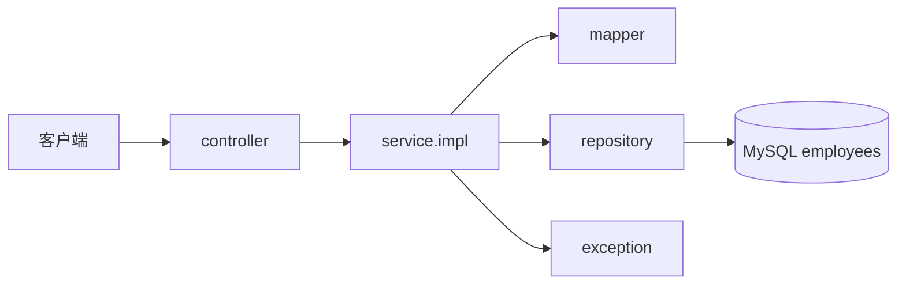
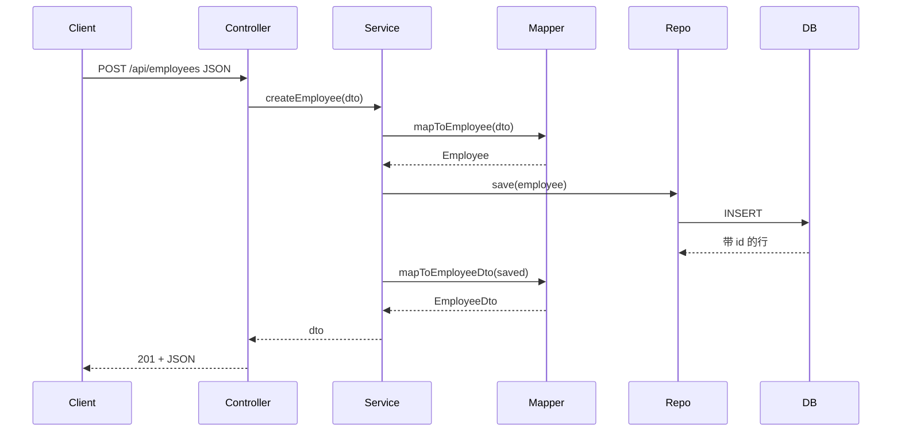

# EMS 员工管理系统 — 包与类代码讲解报告

| 项目 | 说明 |
|------|------|
| 项目名 | EMS（Employee Management System）员工管理系统 |
| 来源仓库 | https://github.com/ayush2323/Ems_springboot |
| 后端模块 | `ems-backend` |
| 根包名 | `net.javaguides.ems` |
| 技术栈 | Spring Boot 2.7、Spring Data JPA、MySQL、Lombok、REST |
| 说明 | 当前工作区 `shuzu.java` 内无独立 `ems` 工程；本报告基于公开仓库检索到的完整 EMS 后端源码逐包、逐类讲解 |

---

## 1. 项目做什么

EMS 提供员工信息的 REST 增删改查：

| 方法 | 路径 | 作用 |
|------|------|------|
| `POST` | `/api/employees` | 新增员工 |
| `GET` | `/api/employees/{employeeId}` | 按 ID 查询 |
| `GET` | `/api/employees` | 查询全部 |
| `PUT` | `/api/employees/{employeeId}` | 修改员工 |
| `DELETE` | `/api/employees/{employeeId}` | 删除员工 |

请求/响应体使用 `EmployeeDto`（JSON），数据库表为 `employees`。

---

## 2. 目录与包总览

```
net.javaguides.ems
├── EmsBackendApplication.java     # 启动类（根包）
├── controller/                    # 控制层：接收 HTTP
├── dto/                           # 传输对象：前后端交互
├── entity/                        # 实体层：对应数据库表
├── exception/                     # 异常：资源不存在等
├── mapper/                        # 转换：Entity ↔ DTO
├── repository/                    # 持久层：JPA 访问数据库
└── service/                       # 业务层
    ├── EmployeeService.java       # 接口
    └── impl/
        └── EmployeeServiceImpl.java
```

### 各包职责一句话

| 包 | 职责 |
|----|------|
| `net.javaguides.ems` | 启动 Spring Boot |
| `controller` | 暴露 REST 接口，调用 Service，返回 `ResponseEntity` |
| `dto` | 对外数据形状，避免直接暴露实体 |
| `entity` | JPA 实体，映射 `employees` 表 |
| `exception` | 业务/资源异常（如 ID 不存在 → 404） |
| `mapper` | Entity 与 DTO 互转 |
| `repository` | 继承 `JpaRepository`，CRUD 由 Spring Data 生成 |
| `service` / `service.impl` | 业务编排：查库、校验、转换 |

### 请求调用链



---

## 3. 根包：`net.javaguides.ems`

### 3.1 `EmsBackendApplication`

```java
@SpringBootApplication
public class EmsBackendApplication {
    public static void main(String[] args) {
        SpringApplication.run(EmsBackendApplication.class, args);
    }
}
```

**作用：**

- `@SpringBootApplication`：自动配置 + 组件扫描（默认扫描本包及子包）
- `main`：启动内嵌 Tomcat，加载 Controller / Service / Repository

没有业务逻辑，只负责把应用跑起来。

---

## 4. 包 `controller` — 控制层

### 4.1 `EmployeeController`

**作用：** 员工模块唯一入口；把 URL 映射到 Service 方法。

关键注解：

| 注解 | 含义 |
|------|------|
| `@RestController` | 返回值直接写 JSON（`@Controller` + `@ResponseBody`） |
| `@RequestMapping("/api/employees")` | 类级路径前缀 |
| `@AllArgsConstructor` | Lombok 生成全参构造，注入 `EmployeeService` |

#### 代码逐方法讲解

**① 新增**

```java
@PostMapping
public ResponseEntity<EmployeeDto> createEmployee(@RequestBody EmployeeDto employeeDto) {
    EmployeeDto savedEmployee = employeeService.createEmployee(employeeDto);
    return new ResponseEntity<>(savedEmployee, HttpStatus.CREATED);
}
```

- `@RequestBody`：把 JSON 反序列化成 `EmployeeDto`
- 调用 Service 落库
- 返回 **201 Created** 和保存后的 DTO（含生成的 `id`）

**② 按 ID 查**

```java
@GetMapping("/{employeeId}")
public ResponseEntity<EmployeeDto> getEmployeeById(@PathVariable("employeeId") Long employeeId) {
    EmployeeDto employeeDto = employeeService.getEmployeeById(employeeId);
    return ResponseEntity.ok(employeeDto);
}
```

- `@PathVariable`：从路径取 `employeeId`
- 不存在时由 Service 抛 `ResourceNotFoundException`（HTTP 404）

**③ 查全部**

```java
@GetMapping
public ResponseEntity<List<EmployeeDto>> getAllEmployees() {
    List<EmployeeDto> employees = employeeService.getAllEmployees();
    return ResponseEntity.ok(employees);
}
```

**④ 修改**

```java
@PutMapping("{employeeId}")
public ResponseEntity<EmployeeDto> updateEmployee(
        @PathVariable("employeeId") Long employeeId,
        @RequestBody EmployeeDto updateEmployee) {
    EmployeeDto employeeDto = employeeService.updateEmployee(employeeId, updateEmployee);
    return ResponseEntity.ok(employeeDto);
}
```

- 路径带 ID，body 带要改的字段

**⑤ 删除**

```java
@DeleteMapping("{employeeId}")
public ResponseEntity<String> deleteEmployee(@PathVariable("employeeId") Long employeeId) {
    employeeService.deleteEmployee(employeeId);
    return ResponseEntity.ok("Employee Deleted");
}
```

Controller **不写 SQL、不做 Entity 转换**，只做协议层工作。

---

## 5. 包 `dto` — 数据传输对象

### 5.1 `EmployeeDto`

```java
@Getter @Setter @NoArgsConstructor @AllArgsConstructor
public class EmployeeDto {
    private Long id;
    private String firstName;
    private String lastName;
    private String email;
}
```

**作用：**

- 作为 API 入参/出参
- 与表结构解耦：表字段可改，接口形状可单独演进
- Lombok 生成 getter/setter/构造，减少样板代码

字段含义：`id` 主键；`firstName` / `lastName` 姓名；`email` 邮箱。

---

## 6. 包 `entity` — 实体层

### 6.1 `Employee`

```java
@Entity
@Table(name = "employees")
public class Employee {
    @Id
    @GeneratedValue(strategy = GenerationType.IDENTITY)
    private Long id;

    @Column(name = "first_name")
    private String firstName;

    @Column(name = "last_name")
    private String lastName;

    @Column(name = "email_id", nullable = false, unique = true)
    private String email;
}
```

**作用：** 一张表对应一个类，由 Hibernate 持久化。

| 注解 | 代码含义 |
|------|----------|
| `@Entity` | 这是 JPA 实体 |
| `@Table(name = "employees")` | 表名 |
| `@Id` + `@GeneratedValue(IDENTITY)` | 主键自增 |
| `@Column(name = "first_name")` | Java 驼峰 ↔ 数据库下划线列 |
| `email` 列 `nullable=false, unique=true` | 非空且唯一 |

`ddl-auto=update` 时，启动可自动建/改表结构。

---

## 7. 包 `exception` — 异常

### 7.1 `ResourceNotFoundException`

```java
@ResponseStatus(value = HttpStatus.NOT_FOUND)
public class ResourceNotFoundException extends RuntimeException {
    public ResourceNotFoundException(String message) {
        super(message);
    }
}
```

**作用：**

- 查不到员工时由 Service 抛出
- `@ResponseStatus(NOT_FOUND)`：未被捕获时 Spring 返回 **404**
- 继承 `RuntimeException`，无需在方法签名声明 `throws`

典型消息：`"Employee not found with id: " + employeeId`。

---

## 8. 包 `mapper` — 对象转换（非 MyBatis Mapper）

### 8.1 `EmployeeMapper`

注意：这里是 **手工静态转换类**，不是 MyBatis 的 Mapper 接口。

```java
public class EmployeeMapper {
    public static EmployeeDto mapToEmployeeDto(Employee employee) {
        return new EmployeeDto(
            employee.getId(),
            employee.getFirstName(),
            employee.getLastName(),
            employee.getEmail()
        );
    }

    public static Employee mapToEmployee(EmployeeDto employeeDto) {
        return new Employee(
            employeeDto.getId(),
            employeeDto.getFirstName(),
            employeeDto.getLastName(),
            employeeDto.getEmail()
        );
    }
}
```

**作用：**

- `mapToEmployeeDto`：查库后给前端
- `mapToEmployee`：接请求后准备入库

静态方法、无状态，Service 里直接调用。

---

## 9. 包 `repository` — 持久层

### 9.1 `EmployeeRepository`

```java
@Repository
public interface EmployeeRepository extends JpaRepository<Employee, Long> {
}
```

**作用：**

- 继承 `JpaRepository<Employee, Long>` 后自带：
  - `save` / `findById` / `findAll` / `deleteById` / `existsById` 等
- 泛型：实体类型 `Employee`，主键类型 `Long`
- 接口为空即可完成基础 CRUD；复杂查询可再写 `findByEmail(...)` 等方法名查询

本项目员工 CRUD 全部依赖这些内置方法。

---

## 10. 包 `service` — 业务接口

### 10.1 `EmployeeService`

```java
public interface EmployeeService {
    EmployeeDto createEmployee(EmployeeDto employeeDto);
    EmployeeDto getEmployeeById(Long employeeId);
    List<EmployeeDto> getAllEmployees();
    EmployeeDto updateEmployee(Long employeeId, EmployeeDto updatedEmployee);
    void deleteEmployee(Long employeeId);
}
```

**作用：** 定义业务能力契约；Controller 依赖接口，实现类可替换，便于测试与扩展。

---

## 11. 包 `service.impl` — 业务实现

### 11.1 `EmployeeServiceImpl`

```java
@Service
@AllArgsConstructor
public class EmployeeServiceImpl implements EmployeeService {
    private EmployeeRepository employeeRepository;
    // ...
}
```

`@Service` 注册为 Spring Bean；构造注入 `EmployeeRepository`。

#### ① `createEmployee` — 新增

```java
Employee employee = EmployeeMapper.mapToEmployee(employeeDto);
Employee savedEmployee = employeeRepository.save(employee);
return EmployeeMapper.mapToEmployeeDto(savedEmployee);
```

流程：DTO → Entity → `save`（INSERT）→ Entity → DTO。

#### ② `getEmployeeById` — 按 ID 查

```java
Employee employee = employeeRepository.findById(employeeId)
    .orElseThrow(() ->
        new ResourceNotFoundException("Employee not found with id: " + employeeId));
return EmployeeMapper.mapToEmployeeDto(employee);
```

`Optional` 为空则抛 404 异常。

#### ③ `getAllEmployees` — 列表

```java
List<Employee> employees = employeeRepository.findAll();
return employees.stream()
    .map(EmployeeMapper::mapToEmployeeDto)
    .collect(Collectors.toList());
```

流式把每个 Entity 转成 DTO。

#### ④ `updateEmployee` — 修改

```java
Employee employee = employeeRepository.findById(employeeId)
    .orElseThrow(() -> new ResourceNotFoundException(...));

employee.setFirstName(updateEmployee.getFirstName());
employee.setLastName(updateEmployee.getLastName());
employee.setEmail(updateEmployee.getEmail());

Employee updatedEmployeeObj = employeeRepository.save(employee);
return EmployeeMapper.mapToEmployeeDto(employeeRepository.save(updatedEmployeeObj));
```

要点：

1. 先确认记录存在  
2. 把 DTO 字段写回已托管实体  
3. `save` 触发 UPDATE  

说明：末尾对同一对象 `save` 了两次，第二次多余，保留一次即可（源码小瑕疵）。

#### ⑤ `deleteEmployee` — 删除

```java
employeeRepository.findById(employeeId)
    .orElseThrow(() -> new ResourceNotFoundException(...));
employeeRepository.deleteById(employeeId);
```

先确认存在再删，避免静默失败。

---

## 12. 一次完整请求示例（新增员工）



---

## 13. 配置要点（`application.properties`）

| 配置 | 作用 |
|------|------|
| `spring.datasource.url=.../ems_backend` | 连接 MySQL 库 |
| `spring.jpa.hibernate.ddl-auto=update` | 按实体自动维护表结构 |
| `logging.level.org.hibernate.SQL=DEBUG` | 打印 SQL，便于学习 |

---

## 14. 类清单速查

| 类 | 包 | 核心作用 |
|----|-----|----------|
| `EmsBackendApplication` | 根包 | 启动 |
| `EmployeeController` | controller | REST 五个接口 |
| `EmployeeDto` | dto | API 数据载体 |
| `Employee` | entity | 表 `employees` 映射 |
| `ResourceNotFoundException` | exception | 404 业务异常 |
| `EmployeeMapper` | mapper | Entity ↔ DTO |
| `EmployeeRepository` | repository | JPA CRUD |
| `EmployeeService` | service | 业务接口 |
| `EmployeeServiceImpl` | service.impl | 业务实现 |

---

## 15. 检索说明与另一份同类项目

在当前 GitHub 账号与本仓库中未发现自有 `ems` 工程，公开检索到的典型 EMS 示例包括：

1. **本报告主体**：`ayush2323/Ems_springboot`（`net.javaguides.ems`，REST + JPA，分层完整）  
2. **中文教学向**：`yangtz24/ems_springboot`（`com.baizhi.ems.ytz`，Thymeleaf + JPA；含 Admin 登录，但员工 Controller 未实现完整，遗留 MyBatis XML）

若你本地另有私有/未推送的 EMS 仓库，把链接或路径发来后，可按同样粒度再出一版「针对你那份源码」的讲解。

---

## 16. 学习建议阅读顺序

1. `entity.Employee` — 表怎么映射  
2. `repository.EmployeeRepository` — 数据怎么存取  
3. `dto` + `mapper` — 为什么不把 Entity 直接返回  
4. `service.impl` — 业务与异常怎么处理  
5. `controller` — HTTP 怎么接到业务上  
6. 最后看 `exception` 与启动类  

读完应能独立画出：**请求 → Controller → Service → Mapper/Repository → DB** 全路径。
