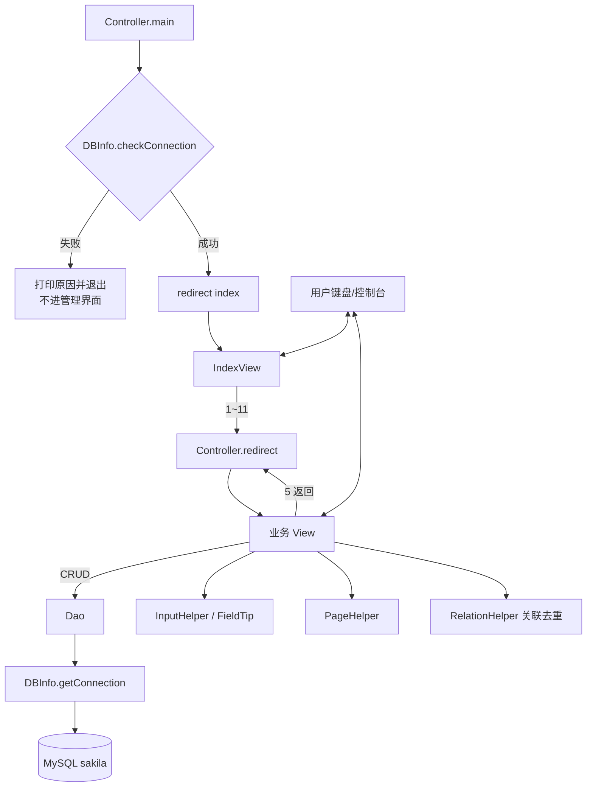
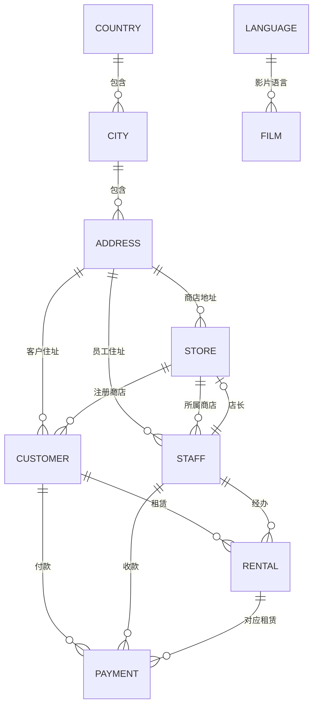

# Sakila 在线影院管理系统 — 技术文档报告

| 项目 | 说明 |
|------|------|
| 模块路径 | `sakila/` |
| 入口类 | `org.sakila.Controller` |
| 架构风格 | 控制台 MVC（Controller → View → Dao → Entity / MySQL） |
| 数据库 | MySQL `sakila` |
| 技术栈 | Java 25、JDBC、MySQL Connector/J 9.6.0 |
| 文档版本 | 与当前源码同步（含城市管理、动态条件查询、分页、关联去重展示、安全输入、启动连库检测） |

---

## 1. 项目概述

本系统是基于官方 **Sakila** 样例库的控制台管理系统。用户通过键盘选择菜单，完成对影院相关业务表的 **增、删、改、查**。

当前纳入管理的 **11** 张表：

| 菜单号 | 表名 | 中文含义 | View | Dao | Entity |
|--------|------|----------|------|-----|--------|
| 1 | `category` | 影片类别 | `CategoryView` | `CategoryDao` | `Category` |
| 2 | `payment` | 支付 | `PaymentView` | `PaymentDao` | `Payment` |
| 3 | `language` | 语言 | `LanguageView` | `LanguageDao` | `Language` |
| 4 | `film` | 影片 | `FilmView` | `FilmDao` | `Film` |
| 5 | `customer` | 客户 | `CustomerView` | `CustomerDao` | `Customer` |
| 6 | `staff` | 员工 | `StaffView` | `StaffDao` | `Staff` |
| 7 | `country` | 国家 | `CountryView` | `CountryDao` | `Country` |
| 8 | `city` | 城市 | `CityView` | `CityDao` | `City` |
| 9 | `store` | 商店 | `StoreView` | `StoreDao` | `Store` |
| 10 | `address` | 地址 | `AddressView` | `AddressDao` | `Address` |
| 11 | `rental` | 租赁 | `RentalView` | `RentalDao` | `Rental` |
| 0 | — | 退出系统 | — | — | — |

数据库脚本：

- `sakila/doc/sakila-schema.sql`（表结构）
- `sakila/doc/sakila-data.sql`（样例数据）

---

## 2. 目录结构

```
sakila/
├── pom.xml
├── doc/
│   ├── sakila-schema.sql
│   ├── sakila-data.sql
│   └── 技术文档报告.md          # 本文档
└── src/main/java/org/sakila/
    ├── Controller.java          # 入口：先检测数据库，再跳转页面
    ├── common/
    │   ├── DBInfo.java          # JDBC 连接 + checkConnection 启动探测
    │   ├── FieldTip.java        # 添加时字段说明
    │   ├── InputHelper.java     # 安全输入 / 回车跳过 / 查询条件
    │   ├── PageHelper.java      # 查询结果分页（每页 10 条）
    │   └── RelationHelper.java  # 查询后附带关联表（按主键去重）
    ├── entity/                  # 实体 + 中文 toString
    ├── dao/                     # JDBC + selectByCondition 动态条件
    └── view/                    # 控制台菜单
        ├── View.java
        ├── IndexView.java
        └── *View.java
```

---

## 3. 总体架构与分层职责

| 层次 | 包 / 类 | 职责 |
|------|---------|------|
| 控制层 | `Controller` | `main` 启动前检测数据库；通过后 `redirect` 跳转页面 |
| 视图层 | `org.sakila.view.*` | 菜单、读入、组装实体、调用 Dao、展示结果 |
| 数据访问层 | `org.sakila.dao.*` | `DBInfo.getConnection()` + SQL；统一 `selectByCondition` |
| 实体层 | `org.sakila.entity.*` | 表字段映射；`toString()` 用中文标签输出 |
| 公共层 | `org.sakila.common.*` | 连接探测、录入提示、输入校验、分页、关联去重展示 |

### 3.1 分层总览



一句话：

> **先连库检测 → Controller 跳转 → View 交互 → Dao 访问数据库 → 主表分页 → RelationHelper 去重展示关联表。**

---

## 4. 模块间调用逻辑

### 4.1 启动（含数据库门禁）

```
Controller.main
  → 打印「正在检测数据库连接...」
  → DBInfo.checkConnection()
       ├─ 失败：打印检查项与失败原因，return（不进入管理界面）
       └─ 成功：打印「数据库连接成功。」
            → redirect("index")
                 → IndexView.indexWindow()
```

`checkConnection()` 内部：`getConnection()` 后执行 `SELECT 1`，确认连接真正可用；无论成败都会关闭探测用连接。

### 4.2 首页菜单 → 业务模块

| 输入 | `redirect` 键 |
|------|----------------|
| 1～11 | category / payment / language / film / customer / staff / country / city / store / address / rental |
| 0 | 打印再见并结束 |
| 其他 | 提示后递归再显示首页 |

### 4.3 业务模块统一模式

每个业务 View：

1. `indexWindow`：1 添加 / 2 修改 / 3 删除 / 4 查询 / 5 返回首页  
2. 选 1～4 后执行对应窗口，再递归回本模块菜单  
3. 选 5：`Controller.redirect("index"); return;`

### 4.4 一次查询调用链（以城市为例）

```
CityView.queryWindow
  → InputHelper.filterInt / filterString（回车=忽略条件）
  → CityDao.selectByCondition(cityId, cityKey, countryId)
      → DBInfo.getConnection()
      → 动态 SQL：where 1=1 + 可选条件 + left join country
  → InputHelper.printList(list, in)
      → RelationHelper.printWithRelations
           → PageHelper.printPaged（主表，>10 条则分页）
           → 按外键收集关联记录并去重
           → 打印「关联【国家】（去重后共 M 条）」等
```

---

## 5. 控制层：`Controller`

静态 `Map<String, View> viewMap` 注册全部页面；`redirect(name)` 调用对应 `indexWindow()`。

已注册键：`index`、`category`、`payment`、`language`、`film`、`customer`、`staff`、`country`、`city`、`store`、`address`、`rental`。

### 5.1 启动连库门禁

`main` **不会**直接进首页，必须先通过数据库检测：

| 结果 | 行为 |
|------|------|
| 连接成功 | 提示成功，再 `redirect("index")` 进入系统管理界面 |
| 连接失败 | 提示无法进入系统，列出检查项（MySQL 是否启动、sakila 是否导入、`DBInfo` 账号、驱动是否齐全），打印失败原因后 **直接结束程序** |

这样可避免「菜单能进、一点查询就一堆 JDBC 异常」的体验问题。

---

## 6. 视图层交互规范

### 6.1 添加（Add）

- 使用 `FieldTip` 打印必填/可空说明  
- 必填项用 `InputHelper.readRequiredInt/String/Decimal`（空或非法会重输）  
- 可空项用 `readOptionalInt/String`（回车表示空）

### 6.2 修改（Update）

- 先输入 **必填 ID**（空回车会提示“不能为空”并重输）  
- 再逐字段：`keepString` / `keepInt` / `keepDecimal` / `keepActive`  
- **直接回车 = 保留原值**，提示形如：`字段名(当前: xxx, 回车跳过):`

### 6.3 删除（Delete）

- 必填 ID → `getById` 校验存在 → `delete`

### 6.4 查询（Query）

不再使用 1/2/3 子菜单，统一为 **多条件表单**：

```
说明：直接回车表示忽略该条件；全部回车则查询全部。
条件1(回车忽略):
条件2(回车忽略):
...
```

全部回车 → 查全部；填了哪些条件就带哪些条件进 `selectByCondition`。

---

## 7. 公共工具详解

### 7.1 `DBInfo`

- JDBC URL：`jdbc:mysql://localhost:3306/sakila`（含时区、UTF-8、SSL 相关参数）  
- 静态块：`Class.forName("com.mysql.cj.jdbc.Driver")`  
- `getConnection()`：所有 Dao 统一从此取连接  
- `checkConnection()`：启动探测用  
  - 成功返回 `null`  
  - 失败返回错误信息字符串（由 `Controller.main` 打印后退出）  
  - 内部执行 `SELECT 1` 并关闭连接，不占用长期连接  

### 7.2 `FieldTip`

添加前打印表名、必填/可空字段说明。

### 7.3 `InputHelper`（输入核心）

| 方法 | 用途 |
|------|------|
| `readRequiredInt/String/Decimal` | 必填；空或非法重输 |
| `readOptionalInt/String/Decimal` | 可空；回车跳过 |
| `keepString/Int/Integer/Decimal/Active` | 修改时回车保留原值；非法重输 |
| `filterInt/filterString` | 查询条件；回车返回 `null` 表示忽略 |
| `printList(list, in)` | 交给 `RelationHelper.printWithRelations`（主表分页 + 关联去重） |
| `printQueryTip()` | 打印查询条件说明 |

### 7.4 `PageHelper`（分页）

- 每页 **10** 条（`PAGE_SIZE = 10`）  
- **≤10 条**：一次全部打印 + `共 N 条`  
- **>10 条**：分页循环  
  - 页眉：`第 X 页（共 Y 页，共 N 条）`  
  - 页脚：`当前第 X 页，共 Y 页`  
  - `1` 上一页 / `2` 下一页 / `3` 退出显示  

### 7.5 `RelationHelper`（查询关联去重展示）

查询主表结束后，自动把**相关联表**的内容一并输出；同一关联主键**只显示一次**。

**展示顺序：**

1. 先分页浏览主表结果（与原先一致；按 `3` 退出分页）  
2. 再输出关联区块，例如：  
   `>>>>>>>>>> 关联【国家】（去重后共 1 条） <<<<<<<<<<`  
3. 关联列表若超过 10 条，同样走 `PageHelper` 分页  

**去重规则：** 用 `LinkedHashMap` 按关联表主键收集，先出现的保留，后续相同 ID 跳过。

**各主表附带的关联：**

| 查询主表 | 附带关联表（去重） |
|----------|--------------------|
| 城市 `city` | 国家 |
| 地址 `address` | 城市、国家 |
| 商店 `store` | 员工(店长)、地址 |
| 员工 `staff` | 地址、商店 |
| 客户 `customer` | 商店、地址 |
| 影片 `film` | 语言 |
| 支付 `payment` | 客户、员工、租赁 |
| 租赁 `rental` | 客户、员工、影片 |
| 国家 `country` | 城市（该结果中国家下的城市，按城市编号去重） |
| 类别 / 语言 | 无外键关联业务表，不追加 |

实现入口：`InputHelper.printList` → `RelationHelper.printWithRelations`。业务 View 无需改调用方式。

---

## 8. 数据访问层：动态条件查询

各 Dao 的查询统一为：

```text
select ... from 主表 [left join 关联表 ...] where 1=1
  [and 条件1]
  [and 条件2]
  ...
order by 主键
```

条件对象非空才拼进 SQL（与教学项目 `CityDao.selectByCondition` 同一思路）。  
`getById` 一般复用 `selectByCondition(id, null, ...)` 取第一条。

### 8.1 各表查询条件一览

| Dao | `selectByCondition` 主要条件 |
|-----|------------------------------|
| `CategoryDao` | 类别编号、名称关键字 |
| `LanguageDao` | 语言编号、名称关键字 |
| `CountryDao` | 国家编号、名称关键字 |
| `CityDao` | 城市编号、城市名关键字、国家编号（join country） |
| `AddressDao` | 地址编号、地址/地区关键字、城市编号（join city/country） |
| `StoreDao` | 商店编号、店长员工编号（join staff/address） |
| `StaffDao` | 员工编号、姓名/用户名关键字、商店编号（join address/city） |
| `CustomerDao` | 客户编号、姓名/邮箱关键字、商店编号（join address/city） |
| `FilmDao` | 影片编号、片名关键字、语言编号（join language） |
| `PaymentDao` | 支付编号、客户编号、员工编号（join customer/staff） |
| `RentalDao` | 租赁编号、客户编号、员工编号（join customer/staff/inventory/film） |

> 说明：Dao 层 `left join` 便于按条件筛选；控制台在主表单行中文输出之外，由 `RelationHelper` 在查询结束后**单独、去重**列出关联表完整记录。

### 8.2 连接与关闭模式

```text
Connection conn = null;
try {
    conn = DBInfo.getConnection();
    // PreparedStatement ...
} catch (SQLException e) {
    e.printStackTrace();
} finally {
    close(conn);
}
```

---

## 9. 实体层与中文输出

实体 `toString()` 使用中文标签，例如：

```text
【语言】语言编号=1 | 语言名称=English | 最后更新时间=...
```

便于在查询、修改前后对照时直接看懂字段含义。

---

## 10. 业务特殊处理

### 10.1 `store` ↔ `staff` 循环外键

插入 `StoreDao.add` / `StaffDao.add` 时临时：

```sql
SET FOREIGN_KEY_CHECKS=0;
-- INSERT ...
SET FOREIGN_KEY_CHECKS=1;
```

### 10.2 `address.location`

表字段为非空 geometry；插入时 SQL 写死：

```sql
ST_GeomFromText('POINT(0 0)', 0)
```

实体与查询不展示 `location`。

### 10.3 `customer.create_date`

插入时用 `NOW()`；界面不要求用户输入。

### 10.4 影片语言列表

添加/修改影片输入语言 ID 前，调用 `FilmDao.listLanguages()` 打印可选语言。

---

## 11. 表关系（业务理解）



建议录入顺序：国家 → 城市 → 地址 → 语言/类别 → 员工/商店 → 客户/影片 → 租赁/支付。

---

## 12. 依赖与运行

### 12.1 Maven（`pom.xml`）

| 依赖 | 版本 |
|------|------|
| `com.mysql:mysql-connector-j` | 9.6.0 |

编译级别：Java 25。

### 12.2 运行检查

快速自检见 **第 15 章「如何部署」**。最少确认：

1. MySQL 已导入 `sakila-schema.sql` / `sakila-data.sql`  
2. `DBInfo` 用户名密码与本地一致  
3. IDEA 运行模块为 **sakila**，Classpath 含 MySQL 驱动  
4. 主类：`org.sakila.Controller`  

### 12.3 常见问题

完整排障表见 **§15.8**。摘要：

| 现象 | 常见原因 |
|------|----------|
| `No suitable driver found` | 驱动未进运行 classpath |
| `找不到主类 Controller` | 模块未编译 / 输出目录不对 |
| `NumberFormatException: ""` | 已被 InputHelper 防护；若仍出现说明某处未走辅助方法 |
| 外键失败 | 关联 ID 不存在或录入顺序不对 |

---

## 13. “谁调用谁”总表

| 调用方 | 被调用方 | 目的 |
|--------|----------|------|
| `Controller.main` | `DBInfo.checkConnection()` | 启动门禁：连不上则不进系统 |
| `Controller.main` | `redirect("index")` | 连库成功后进入首页 |
| `Controller.redirect` | `View.indexWindow` | 换页 |
| `IndexView` | `redirect(业务键)` | 进模块 |
| 业务 View | `redirect("index")` | 回首页 |
| 业务 View | `InputHelper` / `FieldTip` | 输入与提示 |
| 业务 View | `Dao.selectByCondition` 等 | 增删改查 |
| 业务 View | `InputHelper.printList` → `RelationHelper` → `PageHelper` | 主表分页 + 关联去重输出 |
| Dao | `DBInfo.getConnection` | 拿连接 |
| Dao | MySQL | 执行 SQL |
| Entity.`toString` | 控制台 | 中文展示一行记录 |

---

## 14. 扩展新表的标准步骤

1. 新建 Entity（含中文 `toString`）  
2. 新建 Dao：CRUD + `selectByCondition`（`where 1=1` 动态条件，需要时 `left join`）  
3. 新建 View：菜单 + 增删改查；修改走 `keep*`；查询走 `filter*` + `printList(..., in)`  
4. `Controller.viewMap.put("xxx", new XxxView())`  
5. `IndexView` 增加菜单项并 `redirect("xxx")`  

---

## 15. 如何部署（从零跑起来）

本节面向第一次拿到本项目的同学：按顺序做完，即可在本机运行「Sakila 在线影院管理系统」。

### 15.1 环境准备

| 软件 | 建议版本 | 用途 |
|------|----------|------|
| JDK | 17 及以上（本项目 `pom` 写的是 25，用本机已装的 JDK 即可） | 编译、运行 Java |
| MySQL | 5.7 / 8.0 均可 | 存放 sakila 库 |
| IntelliJ IDEA | 社区版/旗舰版均可 | 推荐的运行方式 |
|（可选）Navicat / MySQL Workbench | — | 可视化导入 SQL |

检查 JDK（终端）：

```bash
java -version
javac -version
```

检查 MySQL 服务已启动，并能用账号登录（例如 `root`）。

### 15.2 准备项目与驱动

1. 打开工程目录：`javafirst`（其中业务代码在子目录 `sakila/`）。  
2. 确认 MySQL 驱动 jar 存在（二选一即可）：  
   - 父工程库：`javafirst/lib/mysql-connector-j-9.6.0.jar`  
   - 或由 Maven 下载：`sakila/pom.xml` 中已声明 `com.mysql:mysql-connector-j:9.6.0`  

若 IDEA 中 `sakila` 模块报找不到驱动：  
**File → Project Structure → Modules → sakila → Dependencies → + → JARs**，选中上述 jar；或对 `sakila/pom.xml` 执行 **Maven Reload**。

### 15.3 部署数据库

1. 启动本机 MySQL。  
2. 依次执行脚本（顺序不要反）：  
   - `sakila/doc/sakila-schema.sql`（建库建表）  
   - `sakila/doc/sakila-data.sql`（导入样例数据）  

**方式 A：Navicat / Workbench**

1. 连接到本机 MySQL。  
2. 打开并运行 `sakila-schema.sql`。  
3. 再打开并运行 `sakila-data.sql`。  
4. 确认库名 `sakila` 存在，且有 `film`、`customer`、`city` 等表。

**方式 B：命令行**

```bash
# 按你的安装路径/账号修改；密码按提示输入
mysql -u root -p < sakila/doc/sakila-schema.sql
mysql -u root -p < sakila/doc/sakila-data.sql
```

验证：

```sql
USE sakila;
SHOW TABLES;
SELECT COUNT(*) FROM language;
```

能查出行数即说明数据导入成功。

### 15.4 修改数据库连接配置

打开：

`sakila/src/main/java/org/sakila/common/DBInfo.java`

按本机实际情况修改：

| 常量 | 含义 | 示例 |
|------|------|------|
| `URL` | 主机、端口、库名 | `jdbc:mysql://localhost:3306/sakila?...` |
| `USERNAME` | MySQL 用户名 | `root` |
| `PASSWORD` | MySQL 密码 | 改为你自己的密码 |

注意：

- 库名必须是 `sakila`（与脚本一致），除非你改了库名并同步改 URL。  
- 端口默认 `3306`，若本机改过端口，URL 里一并改掉。  
- 改完后需要重新编译再运行。

### 15.5 用 IntelliJ IDEA 运行（推荐）

1. 用 IDEA 打开 `javafirst` 工程（或单独把 `sakila` 当 Maven 模块导入）。  
2. 确认 JDK 已配置：**File → Project Structure → Project SDK**。  
3. 编译：**Build → Rebuild Project**。  
4. 找到主类：`org.sakila.Controller`  
   路径：`sakila/src/main/java/org/sakila/Controller.java`  
5. 右键该类 → **Run 'Controller.main()'**。  
6. 运行配置注意：  
   - **Module / Use classpath of module** 选 **sakila**  
   - Classpath 中能看到 `mysql-connector-j`  

成功标志：控制台先出现连库提示，再出现首页菜单：

```text
正在检测数据库连接...
数据库连接成功。
-------------Sakila在线影院管理系统------------
请选择:
1.类别管理      2.支付管理
...
0.退出系统
```

若出现「数据库连接失败，无法进入系统管理界面」，说明门禁生效，需先修好 MySQL / `DBInfo` / 驱动后再运行。

再随便进一个模块（如「3.语言管理 → 4.查询」），能查出数据即部署完成。

### 15.6 用命令行编译运行（可选）

在项目根目录 `javafirst` 下（路径按本机调整）：

```bash
export JAVA_HOME=/path/to/your/jdk   # macOS 示例见本机 /Library/Java/JavaVirtualMachines/...
cd sakila
mkdir -p out/production/sakila
find src/main/java -name '*.java' > /tmp/sakila_sources.txt

# 编译（驱动 jar 用父工程 lib）
javac -encoding UTF-8 \
  -cp "../lib/mysql-connector-j-9.6.0.jar" \
  -d out/production/sakila \
  @/tmp/sakila_sources.txt

# 运行
java -cp "out/production/sakila:../lib/mysql-connector-j-9.6.0.jar" \
  org.sakila.Controller
```

Windows 下 classpath 分隔符用 `;` 而不是 `:`。

若已安装 Maven，也可在 `sakila/` 目录：

```bash
mvn -q compile
mvn -q exec:java -Dexec.mainClass="org.sakila.Controller"
```

（需本机已配置 `mvn`，且能下载依赖。）

### 15.7 部署验收清单

按下面逐项打勾：

- [ ] JDK、`java`/`javac` 可用  
- [ ] MySQL 服务运行中  
- [ ] 已执行 schema + data，库 `sakila` 有数据  
- [ ] `DBInfo` 账号密码与本机一致  
- [ ] 模块依赖中有 `mysql-connector-j`  
- [ ] 运行 `Controller` 先提示「数据库连接成功」，再出现首页菜单  
- [ ] 故意停掉 MySQL 再运行时，应提示连接失败且**不进入**管理界面  
- [ ] 能查询出语言/国家等表数据  

### 15.8 部署常见故障

| 现象 | 处理办法 |
|------|----------|
| `No suitable driver found` / 启动即报连接失败且原因含 driver | 把 `mysql-connector-j-9.6.0.jar` 加入 sakila 模块依赖后 Rebuild |
| `Access denied for user` | 检查 `DBInfo.USERNAME/PASSWORD`；确认 MySQL 用户权限 |
| `Unknown database 'sakila'` | 未执行 schema，或 URL 库名写错 |
| `Communications link failure` | MySQL 未启动，或主机/端口不对 |
| 启动打印「无法进入系统管理界面」 | 属正常门禁；按提示检查 MySQL、`DBInfo`、驱动后重跑 |
| `找不到或无法加载主类 org.sakila.Controller` | 未编译成功；运行配置选错模块；输出目录无 class 文件 |
| 控制台中文乱码 | IDEA Run Configuration 增加 VM：`-Dfile.encoding=UTF-8` |

### 15.9 交付他人时建议说明

把项目交给同学时，至少告知：

1. 需要本机 MySQL，并导入 `doc` 下两个 SQL。  
2. 必须改 `DBInfo.java` 里的密码。  
3. 推荐用 IDEA 运行 `org.sakila.Controller`，并挂上 MySQL 驱动。  
4. 不要提交真实生产密码到公开仓库（课程演示可本地保留）。

---

## 16. 结语

当前系统在控制台 MVC 基础上，具备：

- **11** 个业务模块（含城市）  
- **启动连库门禁**（`DBInfo.checkConnection`：连不上不进管理界面）  
- **动态多条件查询**（回车忽略条件）  
- **查询关联去重展示**（`RelationHelper`：主表浏览完后列出关联表，相同主键不重复）  
- **修改回车跳过**、**必填/数字安全输入**  
- **超过 10 条自动分页**（显示第几页、共几页；1/2/3 翻页退出）  
- **中文字段输出**

理解主线即可读懂任意模块：

> **先检测数据库 → Controller 跳转 → View 交互 → Dao 动态 SQL → 主表分页 → RelationHelper 去重展示关联表。**

部署主线：

> **装 JDK + MySQL → 导入 SQL → 改 DBInfo → 挂驱动 → 运行 Controller（须通过连库检测）。**

---

*文档随 `sakila` 模块源码更新。若菜单、类名、交互规则或部署方式再变更，请同步修订本文。*
