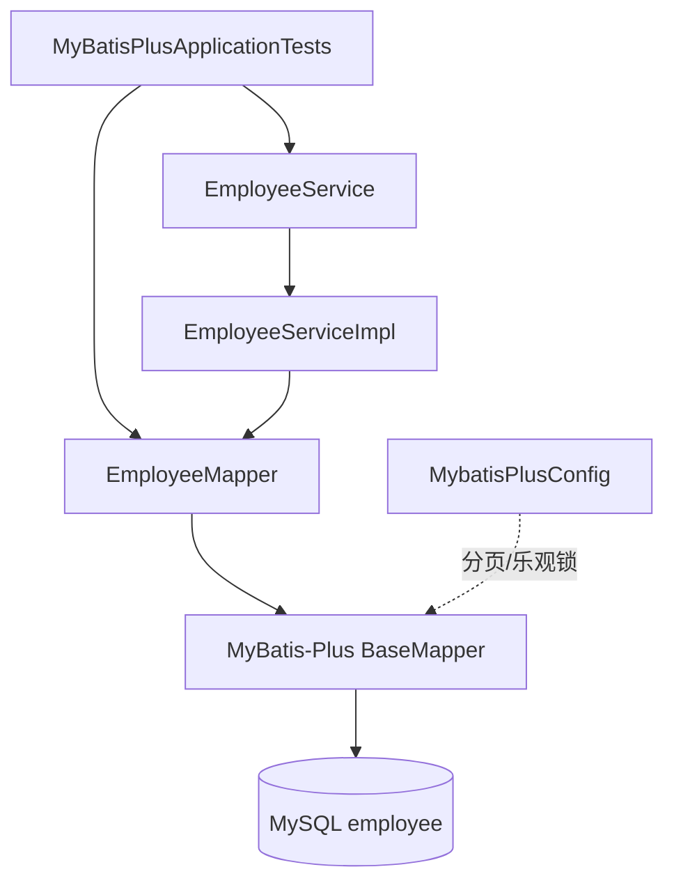
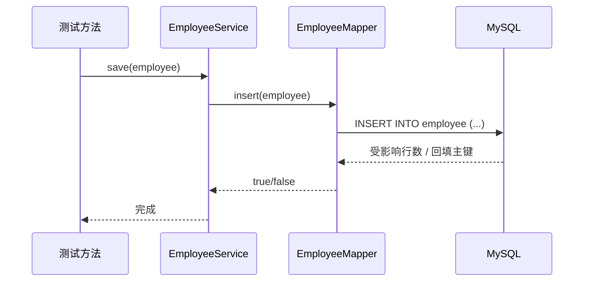

# EMS 员工管理相关代码 — 讲解报告

| 项目 | 说明 |
|------|------|
| 主题 | 员工（Employee）相关代码梳理与讲解 |
| 主模块 | `springboot/springboot-mybatisplus` |
| 关联模块 | `src/YuanGong`、`springboot/springboot-mybatis` |
| 架构风格 | 实体 → Mapper → Service（MyBatis-Plus），以单元测试驱动验证 |
| 数据库 | MySQL（库名见各模块 `application.yml`，主模块为 `mybatis`） |
| 技术栈 | Java 17、Spring Boot 2.6.2、MyBatis-Plus 3.5.6、Lombok、MySQL |
| 文档版本 | 与当前源码同步 |

---

## 1. 项目概述

仓库里没有名为 `ems` 的独立工程目录，但**员工管理（EMS）相关能力**分散在三处，形成清晰的学习递进：

| 阶段 | 路径 | 定位 | 核心内容 |
|------|------|------|----------|
| 入门 OOP | `src/YuanGong/` | 纯 Java 控制台演示 | `Employee` 属性 + 行为 |
| MyBatis 关联 | `springboot/springboot-mybatis/` | 部门 ↔ 员工一对多 | XML `resultMap` / `@Select` |
| MyBatis-Plus 实战 | `springboot/springboot-mybatisplus/` | **主 EMS 模块** | 员工 CRUD、条件查询、分页、Service 层、批量、乐观锁 |

一句话：早期用类理解「员工对象」，中间用 MyBatis 理解「部门-员工表关系」，最终用 MyBatis-Plus 完成可复用的员工数据访问层。

当前主模块**没有 Controller / HTTP 接口**，业务演示集中在 `MyBatisPlusApplicationTests`；适合作为后端持久层练习，而不是完整前后端系统。

---

## 2. 目录结构（主模块）

```
springboot/springboot-mybatisplus/
├── pom.xml
├── doc/
│   └── EMS代码讲解报告.md          # 本文档
└── src/
    ├── main/
    │   ├── java/com/springboot/mybatisplus/
    │   │   ├── MyBatisPlusApplication.java   # 启动类
    │   │   ├── config/MybatisPlusConfig.java  # 分页 + 乐观锁插件
    │   │   ├── entity/
    │   │   │   ├── Employee.java             # 员工实体（核心）
    │   │   │   ├── UserBatch.java            # 批量插入演示实体
    │   │   │   └── OptimisticLock.java       # 乐观锁演示实体
    │   │   ├── mapper/
    │   │   │   ├── EmployeeMapper.java
    │   │   │   ├── UserBatchMapper.java
    │   │   │   └── OptimisticLockMapper.java
    │   │   └── service/
    │   │       ├── EmployeeService.java
    │   │       ├── UserBatchService.java
    │   │       └── impl/
    │   │           ├── EmployeeServiceImpl.java
    │   │           └── BatchServiceImpl.java
    │   └── resources/application.yml
    └── test/java/.../MyBatisPlusApplicationTests.java   # CRUD / 查询 / 分页 / 批量 / 乐观锁
```

关联代码：

```
src/YuanGong/
├── Employee.java    # id / name / salary + ID/work/getSalary
└── main.java        # 构造并调用

springboot/springboot-mybatis/
├── entity/Employee.java、Department.java
├── mapper/EmployeeMapper.java、DepartmentMapper.java
└── resources/mapper/DepartmentMapper.xml   # 一对多两种写法
```

---

## 3. 总体架构与分层职责

| 层次 | 类 / 包 | 职责 |
|------|---------|------|
| 启动层 | `MyBatisPlusApplication` | Spring Boot 启动入口 |
| 配置层 | `MybatisPlusConfig` | 注册分页、乐观锁拦截器 |
| 实体层 | `entity.Employee` 等 | 表字段映射；`@TableName` / `@TableId` / `@Version` |
| 数据访问层 | `mapper.*Mapper` | 继承 `BaseMapper<T>`，零 XML 即可 CRUD |
| 服务层 | `EmployeeService` / `Impl` | 继承 `IService` / `ServiceImpl`，封装批量、saveOrUpdate 等 |
| 验证层 | 测试类 | 用 `@SpringBootTest` 调用 Mapper/Service，代替 Controller |

### 3.1 分层总览



调用链可概括为：

`测试方法 → Mapper/Service → MyBatis-Plus 生成 SQL → MySQL`

---

## 4. 核心类讲解

### 4.1 `Employee`（员工实体）

文件：`entity/Employee.java`

| 字段 | 注解 / 说明 |
|------|-------------|
| `empId` | `@TableId`，主键 |
| `name` | 姓名（曾注释过 `@TableField("emp_name")`，当前按默认驼峰映射） |
| `empGender` | 性别，对应列 `emp_gender` |
| `age` | 年龄 |
| `email` | 邮箱 |
| `remark` | `@TableField(exist = false)`，不存在于表，仅内存用 |

`@TableName("employee")` 指定表名。Lombok `@Data` 等生成 getter/setter/`toString`。

### 4.2 `EmployeeMapper`

```java
@Mapper
public interface EmployeeMapper extends BaseMapper<Employee> {}
```

继承 `BaseMapper` 后，无需手写 XML 即可使用：

- `insert` / `deleteById` / `updateById` / `selectById`
- `selectList` / `selectOne` / `selectBatchIds` / `selectByMap`
- `selectPage`（需分页插件）
- `update(entity, wrapper)` 等条件更新

### 4.3 `EmployeeService` / `EmployeeServiceImpl`

- 接口：`extends IService<Employee>`
- 实现：`extends ServiceImpl<EmployeeMapper, Employee>`

相对 Mapper，Service 更适合：

- `save` / `saveOrUpdate`
- `getOne(wrapper, throwEx)`
- 批量操作、事务边界（后续扩展）

当前实现类为空壳，能力全部来自父类，符合「先跑通再扩展」的写法。

### 4.4 `MybatisPlusConfig`

注册两个内部拦截器：

1. `PaginationInnerInterceptor(DbType.MYSQL)` — 分页 SQL 改写  
2. `OptimisticLockerInnerInterceptor` — 配合 `@Version` 做乐观锁  

注释提醒：多插件时分页建议最后添加；当前顺序是分页在前、乐观锁在后，若后续叠加更多插件需按官方建议调整。

### 4.5 辅助实体（非员工主线，但同模块）

| 类 | 用途 |
|----|------|
| `UserBatch` + `BatchServiceImpl` | `MybatisBatch` 一次插入约 1 万条，演示批量性能写法 |
| `OptimisticLock` | 字段 `@Version version`，更新时版本比对 |

---

## 5. 数据访问能力清单（以测试为准）

主验证文件：`MyBatisPlusApplicationTests.java`

### 5.1 Mapper 层 — 员工 CRUD

| 测试方法 | 能力 | 要点 |
|----------|------|------|
| `testSelect` | 全表查询 | `selectList(null)` |
| `testinsert` | 新增 | 不设主键，由 MP 策略生成 |
| `testUpdateById` | 按主键更新 | 只更新非 null 字段 |
| `testUpdateByName` | 条件更新 | `UpdateWrapper.eq("name", …)` |
| `testSelectById` | 主键查询 | |
| `testSelectBatchIds` | 批量主键查询 | |
| `testSelectByMap` | Map 条件 | 键为**列名**，如 `emp_gender` |
| `testDeleteById` / `testDeleteBatchIds` | 删除 | |

### 5.2 条件构造器

| 测试方法 | 场景 |
|----------|------|
| `testSelectOne` | `eq` 精确匹配姓名+性别 |
| `testSelectList` | 姓名 `like`「磊」且年龄 `< 30` |
| `testSelectList2` | `like` / `or` / `orderByDesc` |
| `testSelectList3` | `likeRight` + `and` 嵌套 `or` |
| `testSelectList4` | `func` 动态：有值才拼条件 |

### 5.3 分页

`testSelectPage`：

1. `QueryWrapper` 设条件（如 `age < 500`）  
2. `new Page<>(1, 10)`  
3. `selectPage` 后可读 `current` / `size` / `total` / `pages` / `records`

依赖配置类中的分页插件，否则不会自动拼 `LIMIT`。

### 5.4 Service 层

| 测试方法 | 能力 |
|----------|------|
| `testSave` | `employeeService.save` |
| `testSaveOrUpdate` | 有主键且存在则更新，否则插入 |
| `testGetOne` | `getOne(wrapper, false)`，多条时不抛异常 |

### 5.5 批量与乐观锁

| 测试方法 | 能力 |
|----------|------|
| `testInsertUserBatch` | `MybatisBatch` 批量 insert |
| `testStreamQuery` | 分页 + ResultHandler 流式消费 |
| `test` | 查 → 改名 → `updateById`，观察 `version` |

---

## 6. 典型调用流程（新增员工）

以 `testSave` 为例：



条件查询（如姓名含「磊」且年龄 &lt; 30）流程：

1. 新建 `QueryWrapper<Employee>`  
2. `.like("name","磊").lt("age",30)`  
3. `employeeMapper.selectList(queryWrapper)`  
4. MyBatis-Plus 生成带 `WHERE` 的 `SELECT`  
5. 映射为 `List<Employee>`

---

## 7. 关联模块补充

### 7.1 `src/YuanGong` — OOP 入门

```java
Employee employee = new Employee("001", "张三", 5000);
employee.ID();       // 打印员工 ID
employee.work();     // 打印正在工作
employee.getSalary();// 打印领工资
```

无数据库、无分层，用于理解「员工」领域对象。

### 7.2 `springboot-mybatis` — 部门与员工一对多

- 表：`t_department`、`t_employees`（`dept_id` 外键）  
- `Department.emps`：`List<Employee>`  

两种查询写法：

1. **嵌套查询**：`departmentAndEmployeeMap` + `collection select=EmployeeMapper.selectEmployeeByDepartmentId`  
2. **嵌套结果 / 联表**：`LEFT JOIN` + `departmentAndEmployeeMap2` 一次查出部门及员工

测试入口：`TestORM#testSelectDepartmentById` / `testSelectDepartmentById2`。

与主模块对比：

| 对比项 | springboot-mybatis | springboot-mybatisplus |
|--------|-------------------|------------------------|
| 员工模型 | 挂在部门下的子集合 | 独立 `employee` 表 CRUD |
| SQL 编写 | XML / 注解手写 | BaseMapper + Wrapper 自动生成 |
| 学习目标 | ORM 关联映射 | 通用 CRUD、分页、Service |

---

## 8. 配置说明

`application.yml` 要点：

- 数据源：`jdbc:mysql://localhost:3306/mybatis`  
- MyBatis-Plus：`log-impl: StdOutImpl`，控制台打印 SQL  

注意：

1. 本地密码写在配置文件中，仅适合个人练习；勿用于生产或公开环境。  
2. `spring.logging.level` 下路径写成了 `com.springbootmybatisplus.mapper`，与实际包名 `com.springboot.mybatisplus` 不一致，若依赖该配置调日志级别，需改为正确包路径。  
3. 表结构脚本未放在模块 `doc/` 内，运行测试前需保证库中已有 `employee`（及批量、乐观锁相关表）。

---

## 9. 代码检查结论

### 9.1 做得好的地方

- 分层清晰：Entity / Mapper / Service / Config 职责明确  
- 充分利用 MyBatis-Plus：几乎零 XML 完成员工全套 CRUD  
- 测试覆盖面广：增删改查、动态条件、分页、Service、批量、乐观锁  
- 与 `springboot-mybatis`、`YuanGong` 形成从 OOP → ORM 关联 → MP 实战的路径  

### 9.2 局限与可改进点

| 项 | 说明 |
|----|------|
| 无 Web 层 | 尚无 Controller / DTO / VO / 统一返回体，不能直接当「完整 EMS 系统」对外服务 |
| 无业务校验 | 姓名、年龄、邮箱等未做非空/格式校验 |
| 无事务示例 | Service 未演示 `@Transactional` |
| 硬编码测试 ID | 部分用例写死雪花 ID，换库后可能失败 |
| 配置与安全 | 明文密码、日志包名笔误 |
| 文档/SQL | 建议补 `employee` 建表脚本，便于他人一键复现 |

### 9.3 若要升级成完整 EMS API（建议方向）

可对齐仓库内已有 `springboot-web` / `springboot-sakila` 风格：

1. 增加 `EmployeeController`（REST）  
2. 引入 `EmployeeDto` / `EmployeeVo`、`CommonResult`、全局异常处理  
3. Service 内做参数校验与业务规则  
4. 可选：对接 `springboot-mybatis` 的部门模型，做「部门下员工」查询  

---

## 10. 快速阅读顺序（建议）

1. `src/YuanGong/Employee.java` — 理解员工对象  
2. `springboot-mybatis` 的 `Department` + `DepartmentMapper.xml` — 理解一对多  
3. `mybatisplus` 的 `Employee` → `EmployeeMapper` → `EmployeeServiceImpl`  
4. `MybatisPlusConfig` — 分页与乐观锁从哪来  
5. 按章节 5 的表格顺序阅读 `MyBatisPlusApplicationTests`  

读完后应能回答：

- 不写 XML 如何完成员工增删改查？  
- `QueryWrapper` 如何拼动态条件？  
- 分页和乐观锁分别依赖什么配置？  
- Mapper 与 Service 各自适合在哪一层调用？

---

## 11. 总结

本仓库的 **EMS 相关代码**以 `springboot-mybatisplus` 的 `Employee` 链路为主干，配合早期 OOP 与 MyBatis 一对多练习，构成一套「员工数据怎么存、怎么查、怎么改」的后端持久层教材。

当前状态：**持久层与测试完备，Web/业务层尚未成型**。若目标是可演示的员工管理系统，下一步优先补 Controller、统一响应与建表脚本即可在现有 Service 之上快速成型。
